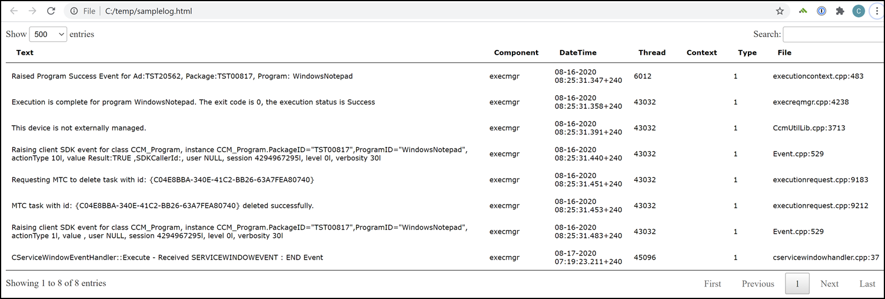

# LogSlothParser

LogSloth Parser aims to import a variety of log files (e.g. SCCM, CSV, Text Based, etc.) and convert them into a normalized PowerShell Object for easy referencing.  

Additionally, this module works to sanitize log inputs so that the logs can be safely shared online. This is a work in progress and could never possibly account for all situations - review your logs carefully before sharing them anywhere public.

Eventually, this module will replace the code currently running the [LogSloth Website](https://www.logsloth.com/).

# Installation Instructions

The latest release of this module will be maintained in the [PowerShellGallary](https://www.powershellgallery.com/packages/LogSlothParser/).

To Install, you can use the `Install-Module` function within PowerShell.  PowerShell version 5.1 or greater (including core) are supported.

```
Install-Module -Name LogSlothParser -AllowPrerelease	
```

This module has been tested on PowerShell versions up through v7.1.3, however future versions should work as well.

# Use Instructions

For more information on how to use this module, see [the docs](/Docs/main.md).

# So, what does this do?

LogSlothParser is a module that turns a log file like this (sample SCCM/MEMCM log file) ...

```
<![LOG[Raised Program Success Event for Ad:TST20562, Package:TST00817, Program: WindowsNotepad]LOG]!><time="08:25:31.347+240" date="08-16-2020" component="execmgr" context="" type="1" thread="6012" file="executioncontext.cpp:483">
<![LOG[Execution is complete for program WindowsNotepad. The exit code is 0, the execution status is Success]LOG]!><time="08:25:31.358+240" date="08-16-2020" component="execmgr" context="" type="1" thread="43032" file="execreqmgr.cpp:4238">
<![LOG[This device is not externally managed.]LOG]!><time="08:25:31.391+240" date="08-16-2020" component="execmgr" context="" type="1" thread="43032" file="CcmUtilLib.cpp:3713">
<![LOG[Raising client SDK event for class CCM_Program, instance CCM_Program.PackageID="TST00817",ProgramID="WindowsNotepad", actionType 10l, value Result:TRUE ,SDKCallerId:, user NULL, session 4294967295l, level 0l, verbosity 30l]LOG]!><time="08:25:31.440+240" date="08-16-2020" component="execmgr" context="" type="1" thread="43032" file="Event.cpp:529">
<![LOG[Requesting MTC to delete task with id: {C04E8BBA-340E-41C2-BB26-63A7FEA80740}]LOG]!><time="08:25:31.451+240" date="08-16-2020" component="execmgr" context="" type="1" thread="43032" file="executionrequest.cpp:9183">
<![LOG[MTC task with id: {C04E8BBA-340E-41C2-BB26-63A7FEA80740} deleted successfully.]LOG]!><time="08:25:31.453+240" date="08-16-2020" component="execmgr" context="" type="1" thread="43032" file="executionrequest.cpp:9212">
<![LOG[Raising client SDK event for class CCM_Program, instance CCM_Program.PackageID="TST00817",ProgramID="WindowsNotepad", actionType 1l, value , user NULL, session 4294967295l, level 0l, verbosity 30l]LOG]!><time="08:25:31.483+240" date="08-16-2020" component="execmgr" context="" type="1" thread="43032" file="Event.cpp:529">
<![LOG[CServiceWindowEventHandler::Execute - Received SERVICEWINDOWEVENT : END Event]LOG]!><time="07:19:23.211+240" date="08-17-2020" component="execmgr" context="" type="1" thread="45096" file="cservicewindowhandler.cpp:37">
```

Into This (PoSH Array of Objects):

DateTime|Component|Text                		                                                                                                                                                  
-|-|-                                                                                                                                                                  
08-16-2020 08:25:31.347+240|execmgr|Raised Program Success Event for Ad:TST20562, Package:TST00817, Program: WindowsNotepad                                                                               
08-16-2020 08:25:31.358+240|execmgr|Execution is complete for program WindowsNotepad. The exit code is 0, the execution status is Success                                                                 
08-16-2020 08:25:31.391+240|execmgr|This device is not externally managed.                                                                                                                                
08-16-2020 08:25:31.440+240|execmgr|Raising client SDK event for class CCM_Program, instance CCM_Program.PackageID="TST00817",ProgramID="WindowsNotepad", actionType 10l, value Result:TRUE ,SDKCallerI...
08-16-2020 08:25:31.451+240|execmgr|Requesting MTC to delete task with id: {C04E8BBA-340E-41C2-BB26-63A7FEA80740}                                                                                         
08-16-2020 08:25:31.453+240|execmgr|MTC task with id: {C04E8BBA-340E-41C2-BB26-63A7FEA80740} deleted successfully.                                                                                        
08-16-2020 08:25:31.483+240|execmgr|Raising client SDK event for class CCM_Program, instance CCM_Program.PackageID="TST00817",ProgramID="WindowsNotepad", actionType 1l, value , user NULL, session 429...
08-17-2020 07:19:23.211+240|execmgr|CServiceWindowEventHandler::Execute - Received SERVICEWINDOWEVENT : END Event                                                                      
                   
Or even this (HTML Export):

